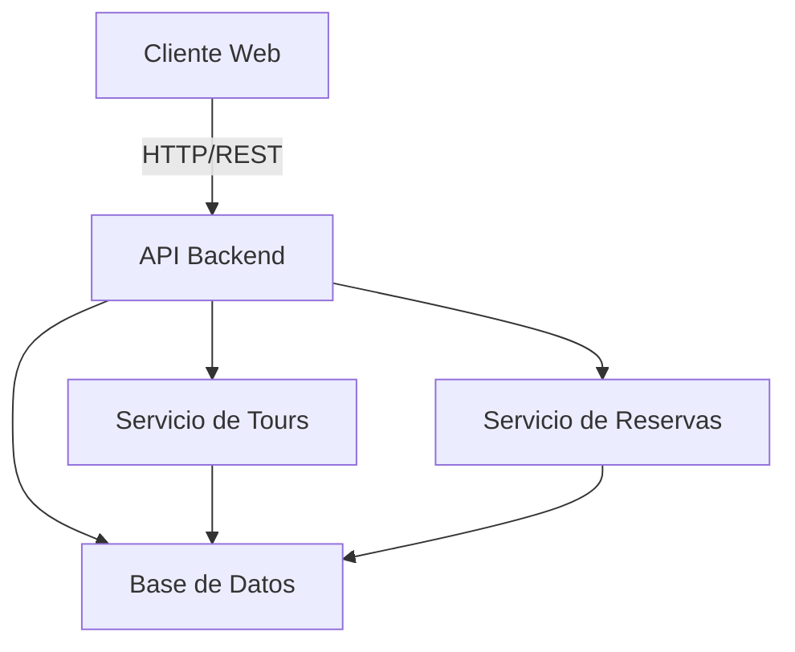

# alekTours

## Descripción

alekTours es una aplicación de gestión y reserva de tours turísticos. Permite a los usuarios explorar diferentes destinos, ver disponibilidad y realizar reservaciones de manera sencilla.

## Características principales

- Visualización de tours disponibles
- Sistema de reservas
- Gestión de usuario
- Historial de reservaciones
- Búsqueda y filtrado de tours

## Arquitectura del proyecto



## APIs disponibles

### Tours

**GET /api/tours**
Obtiene lista de todos los tours disponibles.

Respuesta:
```json
[
  {
    "id": 1,
    "nombre": "Tour Montaña",
    "descripcion": "Recorrido por la montaña",
    "precio": 50,
    "duracion": "4 horas",
    "disponibilidad": 10
  }
]
```

**GET /api/tours/:id**
Obtiene detalles de un tour específico.

### Reservas

**POST /api/reservas**
Crear nueva reserva.

Body:
```json
{
  "usuarioId": 1,
  "tourId": 1,
  "fecha": "2024-01-15",
  "personas": 2
}
```

**GET /api/reservas/:usuarioId**
Obtiene reservaciones de un usuario.

## Estructura de carpetas

```
alekTours/
├── src/
│   ├── api/
│   ├── models/
│   ├── controllers/
│   └── routes/
├── tests/
├── docs/
└── README.md
```

## Instalación

1. Clonar repositorio
2. Instalar dependencias: `npm install`
3. Configurar variables de entorno
4. Iniciar servidor: `npm start`
